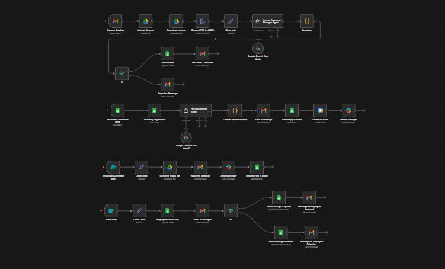

# Human Resource Manager System N8N

**Smart HR automation using N8N - handles hiring, onboarding, and leave requests automatically.**

---

## 📸 All Screenshots

### **Main System**

*Complete HR automation workflow*

*Candidate data stored automatically*

*Manager approval workflow*

*Automated rejection emails*

### **Recruitment Process**

*AI resume screening*

*Interview scheduling*

*Welcome messages*

*Leave request form*

---

## 🚀 How It Works

### **1. Resume Analysis**
- Gmail gets resume emails
- AI scores candidates (0-10)
- Scores ≥6 get shortlisted
- Auto emails sent to all candidates

### **2. Interview Scheduling**
- Watches for new candidates
- Creates interview emails
- Adds to Google Calendar
- Notifies team on Slack

### **3. Employee Onboarding**
- New hires fill form
- Gets welcome email + documents
- Team gets Slack alert
- Data saved to sheets

### **4. Leave Management**
- Employees request leave online
- Manager gets approval email
- Status updated automatically
- Employee gets decision email

---

## 💼 Business Benefits

### **Time Saved**
- Resume screening: 3 hours → 5 minutes
- Interview scheduling: 30 minutes → automatic
- Leave requests: Days → minutes
- Onboarding: 4+ hours → automatic

### **Money Saved**
- HR staff time: $4,000/month
- Recruitment fees: $15,000/month
- Admin costs: $500/month
- Total savings: ~$21,500/month

### **System Cost**
- N8N platform: $50/month
- Google Workspace: $12/month
- Total cost: ~$100/month
- **Payback: Less than 1 month**

---

## 🛠️ Technology

- **N8N**: Workflow automation
- **Google Gemini AI**: Resume analysis
- **Google Workspace**: Email, Drive, Sheets, Calendar
- **Slack**: Team notifications
- **Web Forms**: Data collection

---

## 🎯 Perfect For

- **Small businesses** - No HR staff needed
- **Growing companies** - Scale hiring efficiently  
- **HR teams** - Focus on important tasks

---

**This system pays for itself in the first month and keeps saving money every month through automation.**
- **Paperless Process**: Reduces printing and storage costs
- **Error Prevention**: Minimizes costly mistakes in data entry

### **Efficiency Gains**
- **24/7 Operation**: System works continuously without breaks
- **Instant Processing**: No delays in candidate responses
- **Consistent Quality**: Standardized evaluation for all applicants
- **Data Organization**: Centralized employee information

### **Candidate Experience**
- **Fast Response**: Candidates hear back within minutes, not days
- **Professional Communication**: AI-generated, well-structured emails
- **Smooth Process**: Seamless interview scheduling and onboarding
- **Better Engagement**: Automated follow-ups and status updates

---

## 📊 ROI Calculation Example

### **Monthly Savings Breakdown:**
- **HR Staff Time**: 160 hours × $25/hour = $4,000
- **Recruitment Agency Fees**: 5 hires × $3,000 = $15,000 (saved by in-house)
- **Administrative Costs**: $500/month (paper, printing, storage)
- **Productivity Gains**: $2,000/month (faster hiring, reduced downtime)

**Total Monthly Savings: ~$21,500**
**Annual ROI: ~$258,000**

### **Implementation Costs:**
- **N8N Platform**: $50/month
- **Google Workspace**: $12/month
- **Development Time**: 40 hours (one-time)
- **Maintenance**: 2 hours/month

**Total Monthly Cost: ~$100**
**Payback Period: Less than 1 month**

---

## 🛠️ Technical Stack

- **N8N**: Workflow automation platform
- **Google Gemini AI**: Resume analysis and email generation
- **Google Workspace**: Gmail, Drive, Sheets, Calendar integration
- **Slack**: Team notifications and alerts
- **Web Forms**: Employee and candidate data collection

---

## 📈 Key Metrics Tracked

### **Recruitment Metrics:**
- Resume processing time
- Candidate fit scores
- Time-to-hire
- Offer acceptance rate

### **Employee Metrics:**
- Onboarding completion time
- Leave request processing time
- Employee satisfaction scores
- Manager approval rates

---

## 🔧 System Features

### **Smart Automation**
- AI-powered resume screening
- Automatic candidate ranking
- Intelligent email composition
- Dynamic calendar scheduling

### **Data Management**
- Centralized candidate database
- Employee record tracking
- Leave history logs
- Real-time status updates

### **Communication Hub**
- Automated email notifications
- Slack team integrations
- Multi-channel alerts
- Professional messaging

---

## 🎯 Use Cases

### **For Small Businesses**
- Complete HR solution without dedicated staff
- Professional recruitment process
- Compliance with standard procedures

### **For Growing Companies**
- Scale hiring processes efficiently
- Maintain quality with volume
- Reduce administrative burden

### **For HR Departments**
- Focus on strategic tasks
- Improve candidate experience
- Streamline operations

---

## 📱 Screenshots as Proof

---

## 🚀 Getting Started

1. **Setup N8N Account** - Install and configure N8N platform
2. **Connect Services** - Link Google Workspace, Slack, and email
3. **Import Workflow** - Load the HR Manager System JSON file
4. **Configure Credentials** - Set up API keys and authentication
5. **Customize Templates** - Adjust email templates and forms
6. **Test Workflows** - Run test scenarios for each process
7. **Go Live** - Activate the system and monitor performance

---

## 🔄 Continuous Improvement

The system is designed to learn and improve:
- **AI Model Updates**: Regular improvements to resume analysis
- **Process Optimization**: Workflow refinements based on usage
- **Feature Expansion**: New modules based on business needs
- **Performance Monitoring**: Track success metrics and KPIs

---

## 📞 Support & Maintenance

- **Regular Monitoring**: Check workflow execution logs
- **Backup Procedures**: Automated data backups
- **Security Updates**: Keep credentials and API keys secure
- **Performance Reviews**: Monthly system optimization

---

## 🎉 Conclusion

This HR Manager System transforms traditional HR processes into a streamlined, efficient, and intelligent operation. By leveraging AI and automation, businesses can save significant time and money while improving the employee and candidate experience.

**The system pays for itself within the first month and continues delivering value through reduced operational costs, improved efficiency, and better hiring outcomes.**

*Built with ❤️ using N8N automation platform*

