# Human Resource Manager System

**An intelligent AI-powered HR automation system built with N8N that streamlines recruitment, onboarding, and leave management processes.**

---

## 📸 System Screenshots - Complete Visual Overview

### **Main System Workflow**
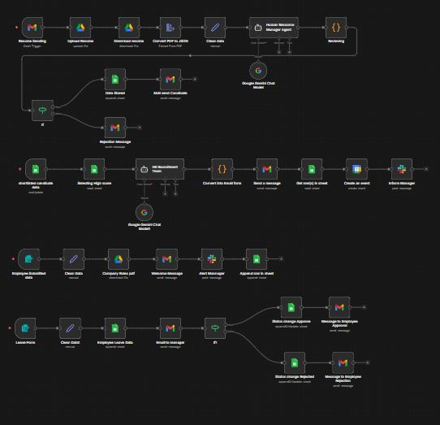
*Complete HR Manager System showing all integrated automation processes*

### **Resume Analysis & Recruitment**
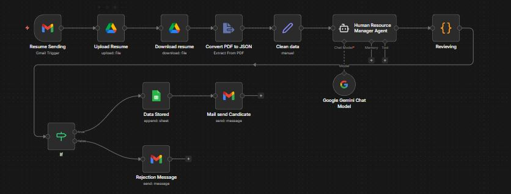
*AI-powered resume screening and candidate evaluation*

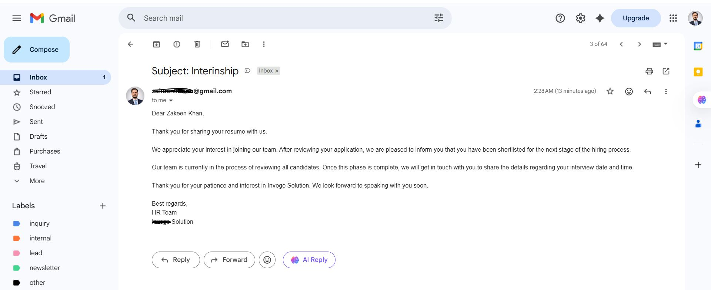
*Candidate selection and interview scheduling process*

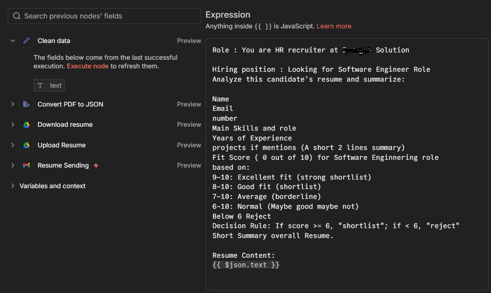
*AI agent configuration for resume analysis*

### **Interview Scheduling**
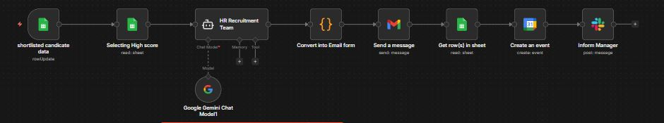
*Automated interview scheduling workflow*

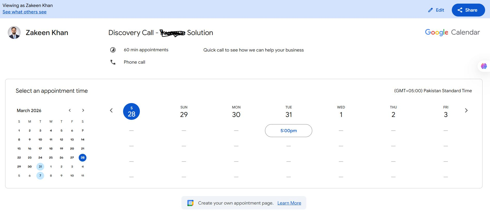
*Google Meet integration for interview appointments*

### **Employee Onboarding**
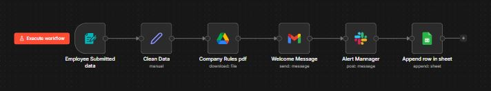
*Complete employee onboarding automation*

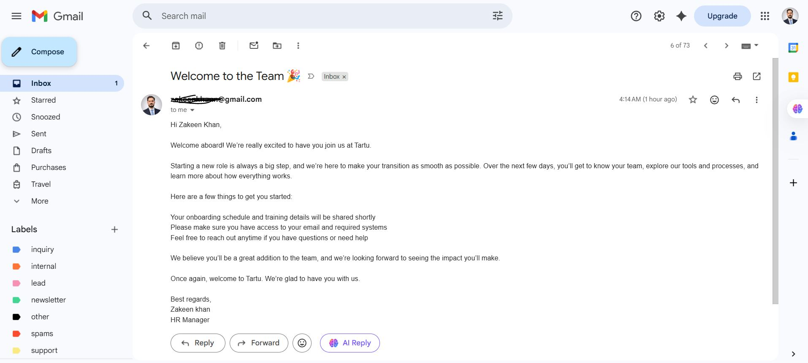
*Welcome message and onboarding communication*

### **Leave Management System**
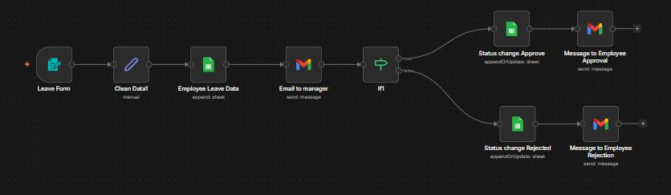
*Employee leave request form*

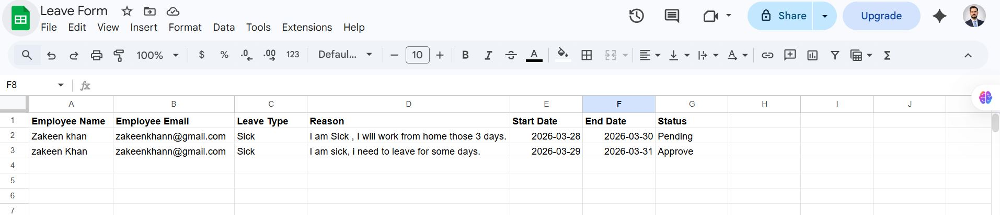
*Leave form data processing and storage*

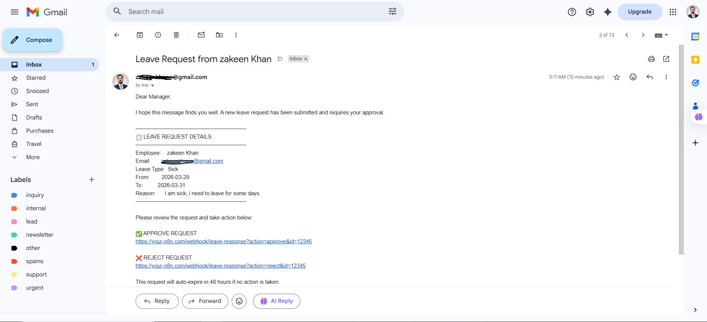
*Sick leave request handling*

### **Data Management & Communication**
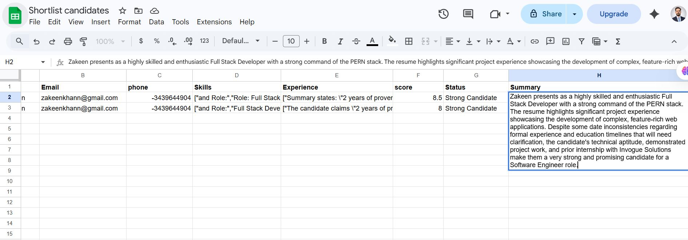
*Automatic data storage in Google Sheets*

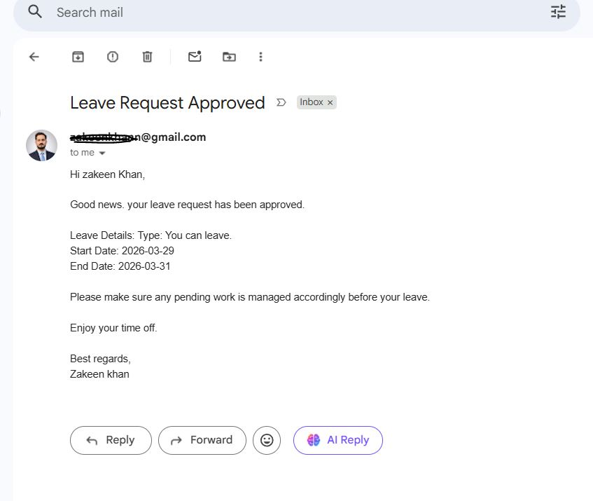
*Manager approval workflow*

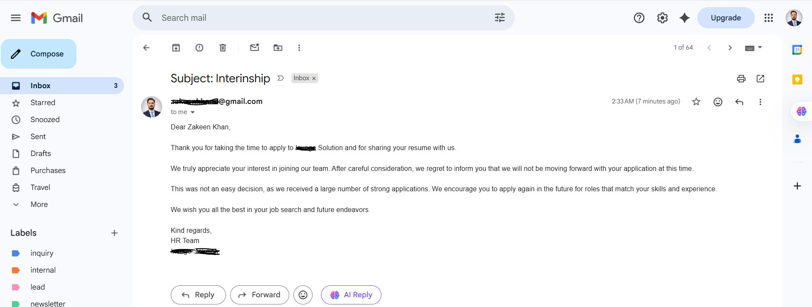
*Professional rejection email automation*

---

## 🚀 Step-by-Step System Explanation

### 1. **Resume Analysis & Recruitment System**

**Workflow Steps:**
1. **Resume Email Trigger** - System automatically checks Gmail for new resume submissions every minute
2. **Resume Upload** - Downloads resume attachments and saves them to Google Drive
3. **PDF Processing** - Converts PDF resumes to text format for AI analysis
4. **AI Analysis** - Uses Google Gemini AI to analyze resumes and score candidates (0-10 scale)
5. **Decision Making** - Automatically shortlists candidates with scores ≥6, rejects others
6. **Data Storage** - Saves candidate information to Google Sheets
7. **Email Notifications** - Sends acceptance or rejection emails to candidates

**AI Analysis Includes:**
- Name, Email, Phone extraction
- Skills and experience assessment
- Project summary analysis
- Fit scoring for Software Engineer role
- Overall resume summary

### 2. **Interview Scheduling System**

**Workflow Steps:**
1. **Candidate Monitoring** - Watches Google Sheets for new shortlisted candidates
2. **AI Email Generation** - Creates professional interview invitation emails
3. **Calendar Integration** - Automatically creates Google Calendar events
4. **Manager Notification** - Sends Slack notifications to HR team
5. **Confirmation Emails** - Sends interview details to candidates

### 3. **Employee Onboarding System**

**Workflow Steps:**
1. **Onboarding Form** - New employees fill welcome form with details
2. **Data Processing** - Cleans and structures employee information
3. **Document Delivery** - Sends company rules and policies PDF
4. **Welcome Email** - Personalized welcome message with onboarding info
5. **Team Notification** - Alerts team via Slack about new employee
6. **Database Update** - Adds employee to company records

### 4. **Leave Management System**

**Workflow Steps:**
1. **Leave Application** - Employees submit leave requests through web form
2. **Data Recording** - Stores leave requests in Google Sheets with "pending" status
3. **Manager Notification** - Emails manager with approval/rejection links
4. **Decision Processing** - Updates status based on manager response
5. **Employee Notification** - Sends approval/rejection emails to employees

---

## 💼 Business Benefits & ROI

### **Time Savings**
- **Resume Screening**: Reduces 2-3 hours per candidate to 5 minutes
- **Interview Scheduling**: Saves 30 minutes per interview coordination
- **Leave Processing**: Cuts approval time from days to minutes
- **Onboarding**: Automates 4+ hours of administrative work

### **Cost Reduction**
- **Reduced HR Staff Hours**: Saves ~40 hours/week of manual work
- **Email Automation**: Eliminates repetitive communication tasks
- **Paperless Process**: Reduces printing and storage costs
- **Error Prevention**: Minimizes costly mistakes in data entry

### **Efficiency Gains**
- **24/7 Operation**: System works continuously without breaks
- **Instant Processing**: No delays in candidate responses
- **Consistent Quality**: Standardized evaluation for all applicants
- **Data Organization**: Centralized employee information

### **Candidate Experience**
- **Fast Response**: Candidates hear back within minutes, not days
- **Professional Communication**: AI-generated, well-structured emails
- **Smooth Process**: Seamless interview scheduling and onboarding
- **Better Engagement**: Automated follow-ups and status updates

---

## 📊 ROI Calculation Example

### **Monthly Savings Breakdown:**
- **HR Staff Time**: 160 hours × $25/hour = $4,000
- **Recruitment Agency Fees**: 5 hires × $3,000 = $15,000 (saved by in-house)
- **Administrative Costs**: $500/month (paper, printing, storage)
- **Productivity Gains**: $2,000/month (faster hiring, reduced downtime)

**Total Monthly Savings: ~$21,500**
**Annual ROI: ~$258,000**

### **Implementation Costs:**
- **N8N Platform**: $50/month
- **Google Workspace**: $12/month
- **Development Time**: 40 hours (one-time)
- **Maintenance**: 2 hours/month

**Total Monthly Cost: ~$100**
**Payback Period: Less than 1 month**

---

## 🛠️ Technical Stack

- **N8N**: Workflow automation platform
- **Google Gemini AI**: Resume analysis and email generation
- **Google Workspace**: Gmail, Drive, Sheets, Calendar integration
- **Slack**: Team notifications and alerts
- **Web Forms**: Employee and candidate data collection

---

## 📈 Key Metrics Tracked

### **Recruitment Metrics:**
- Resume processing time
- Candidate fit scores
- Time-to-hire
- Offer acceptance rate

### **Employee Metrics:**
- Onboarding completion time
- Leave request processing time
- Employee satisfaction scores
- Manager approval rates

---

## 🔧 System Features

### **Smart Automation**
- AI-powered resume screening
- Automatic candidate ranking
- Intelligent email composition
- Dynamic calendar scheduling

### **Data Management**
- Centralized candidate database
- Employee record tracking
- Leave history logs
- Real-time status updates

### **Communication Hub**
- Automated email notifications
- Slack team integrations
- Multi-channel alerts
- Professional messaging

---

## 🎯 Use Cases

### **For Small Businesses**
- Complete HR solution without dedicated staff
- Professional recruitment process
- Compliance with standard procedures

### **For Growing Companies**
- Scale hiring processes efficiently
- Maintain quality with volume
- Reduce administrative burden

### **For HR Departments**
- Focus on strategic tasks
- Improve candidate experience
- Streamline operations

---

## 📱 Screenshots as Proof

*Candidate data automatically stored and organized*

*Manager approval workflow with one-click actions*

*Professional rejection email automation*

---

## 🚀 Getting Started

1. **Setup N8N Account** - Install and configure N8N platform
2. **Connect Services** - Link Google Workspace, Slack, and email
3. **Import Workflow** - Load the HR Manager System JSON file
4. **Configure Credentials** - Set up API keys and authentication
5. **Customize Templates** - Adjust email templates and forms
6. **Test Workflows** - Run test scenarios for each process
7. **Go Live** - Activate the system and monitor performance

---

## 🔄 Continuous Improvement

The system is designed to learn and improve:
- **AI Model Updates**: Regular improvements to resume analysis
- **Process Optimization**: Workflow refinements based on usage
- **Feature Expansion**: New modules based on business needs
- **Performance Monitoring**: Track success metrics and KPIs

---

## 📞 Support & Maintenance

- **Regular Monitoring**: Check workflow execution logs
- **Backup Procedures**: Automated data backups
- **Security Updates**: Keep credentials and API keys secure
- **Performance Reviews**: Monthly system optimization

---

## 🎉 Conclusion

This HR Manager System transforms traditional HR processes into a streamlined, efficient, and intelligent operation. By leveraging AI and automation, businesses can save significant time and money while improving the employee and candidate experience.

**The system pays for itself within the first month and continues delivering value through reduced operational costs, improved efficiency, and better hiring outcomes.**

*Built with ❤️ using N8N automation platform*

